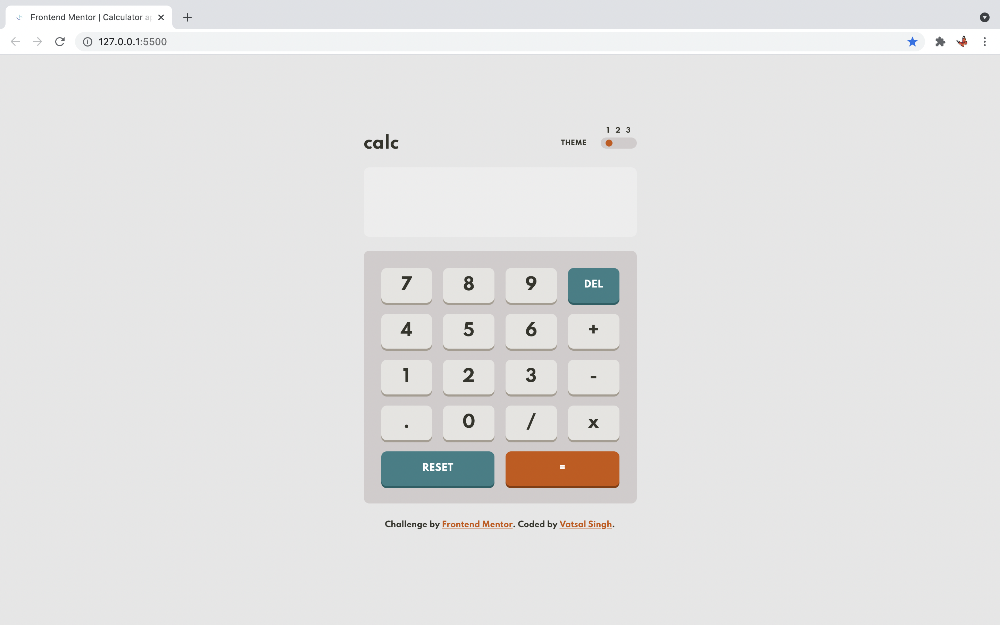
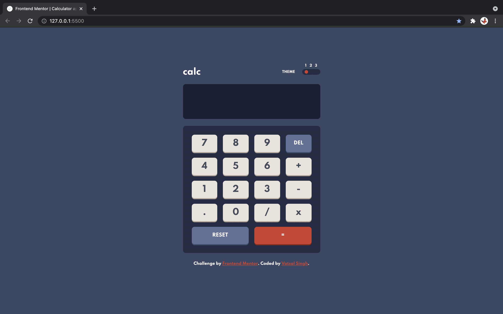
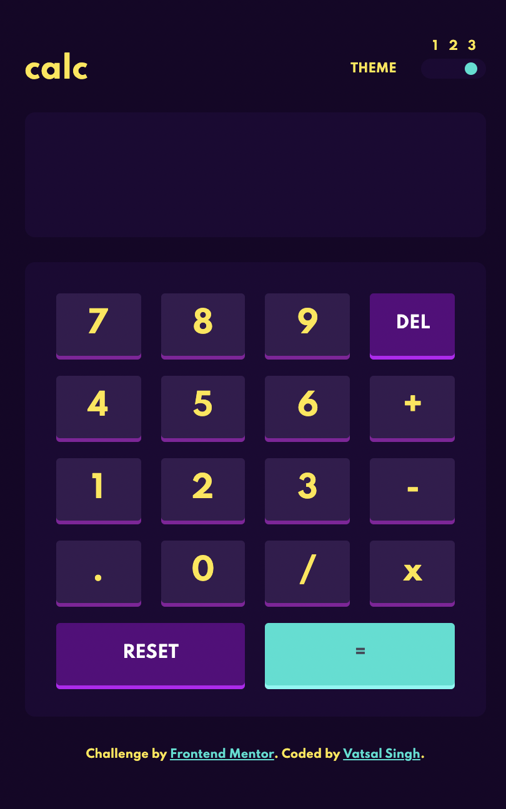

# Frontend Mentor - Calculator app solution

This is a solution to the [Calculator app challenge on Frontend Mentor](https://www.frontendmentor.io/challenges/calculator-app-9lteq5N29). Frontend Mentor challenges help you improve your coding skills by building realistic projects. 

## Table of contents

- [Overview](#overview)
  - [The challenge](#the-challenge)
  - [Screenshot](#screenshot)
  - [Guide](#guide)
  - [Links](#links)
  - [Built with](#built-with)
- [My process](#my-process)
  - [What I learned](#what-i-learned)
  - [Continued development](#continued-development)
  - [Useful resources](#useful-resources)
- [Author](#author)
- [Acknowledgments](#acknowledgments)


## Overview

### The challenge

Users should be able to:

- See the size of the elements adjust based on their device's screen size
- Perform mathmatical operations like addition, subtraction, multiplication, and division
- Adjust the color theme based on their preference
- **Bonus**: Have their initial theme preference checked using `prefers-color-scheme` and have any additional changes saved in the browser

### Screenshot





### Guide

- You can use the calculator using Keyboard (Numeric Keys) as well as by interacting with cursor/touch.
- `Backspace` to remove a digit
- `Ctrl+Z` to reset
- `Shift+1` change to theme-1
- `Shift+2` change to theme-2
- `Shift+3` change to theme-3

### Links

- Solution URL: [https://www.frontendmentor.io/solutions/html-csss-grid-and-preferscolorscheme-and-jquery-yW3GdMroq](https://www.frontendmentor.io/solutions/html-csss-grid-and-preferscolorscheme-and-jquery-yW3GdMroq)
- Live Site URL: [https://vatsalsinghkv.github.io/calculator-app](https://vatsalsinghkv.github.io/calculator-app)

### Built with

- Semantic HTML5 markup
- CSS custom properties
- CSS prefers-color-scheme property
- CSS Grid
- [jQuery](https://jquery.com/) - JS library


## My Process

### What I learned

I have really learned lot of things from this project.

In HTML, learned about attributes like 'tabindex', also learned about some errors like: `Attribute name not allowed on element div at this point` & `The main element must not appear as a descendant of the section element`
```html
<button class="keys primary-key numeric-key" id="5" tabindex="-1" onkeypress="return event.keyCode != 13;">5</button>
```

In CSS, learned about Grid Layour and about Variables, using generalised variables for colors and all, from which achieved multiple themes functionality. Also learned about 'prefers-color-scheme'
```css
.theme-1 {
    /* Backgrounds */
    --main-bg: hsl(222, 26%, 31%);
    --keypad-bg: hsl(223, 31%, 20%);
    --display-bg: hsl(224, 36%, 15%);
    
    /* Keys */
    --primary-key: hsl(30, 25%, 89%);
    --primary-key-shadow: hsl(28, 16%, 65%);

    --secondary-key: hsl(225, 21%, 49%);
    --secondary-key-shadow : hsl(224, 28%, 35%);
    
    --special-key: hsl(6, 63%, 50%);
    --special-key-shadow: hsl(6, 70%, 34%);
    
    /* Text */
    --body-text: hsl(0, 0%, 100%);
    --primary-text: hsl(221, 14%, 31%);
    --secondary-text: hsl(0, 0%, 100%);
}

@media (prefers-color-scheme: light) {
    .theme-1 {
        /* Backgrounds */
        --main-bg: hsl(0, 0%, 90%);
        --keypad-bg: hsl(0, 5%, 81%);
        --display-bg: hsl(0, 0%, 93%);
        
        /* Keys */
        --primary-key: hsl(45, 7%, 89%);
        --primary-key-shadow : hsl(35, 11%, 61%);

        --secondary-key: hsl(185, 42%, 37%);
        --secondary-key-shadow: hsl(185, 58%, 25%);
        
        --special-key: hsl(25, 98%, 40%);
        --special-key-shadow: hsl(25, 99%, 27%);
        
        /* Text */
        --body-text: hsl(60, 10%, 19%);
        --primary-text: hsl(60, 10%, 19%);
        --secondary-text: hsl(0, 0%, 100%);
    }
}

.key-pad {
    display: grid;
    grid-template-columns: repeat(4, 5fr);
    grid-auto-rows: 50px;
    grid-gap: .5rem;
}

.keys {
    -webkit-tap-highlight-color: transparent;
}
```
In JavaScript, I've improved my logical skills, also improved my debugging skills, it took me 4 days to find every exceptions and handle them separately.
```js
let themes = {
    '!': 'theme-1',
    '@': 'theme-2',
    '#': 'theme-3'
};

$(document).keypress((e) => {
    if(e.key in themes) {
        changeTheme(themes[e.key]);
    }
});

function changeTheme(newClass) {
    let oldClass = $('body').attr('class');
    $(`.theme-btn-${getBtnNum(oldClass)}`).removeClass('show');
    $(`.theme-btn-${getBtnNum(newClass)}`).addClass('show');
    $('body').removeClass(oldClass);
    $('body').addClass(newClass);
}

function getBtnNum(str) {
    return str.slice(-1);
}
```

### Continued development

Stuff I find usefull and want to learn:
- [Bootstrap](https://getbootstrap.com/)
- [Node.js](https://nodejs.org/)
- [Express](https://expressjs.com/)
- [React](https://reactjs.org/)

- CSS Grid
- CSS Animations
- CSS Svg
- CSS Canvas

- JS Regular Expressipns

### Useful resources

- [MDN Web Docs](https://developer.mozilla.org/) - This is the best reference I have got. Everything here is so detailed.
- [W3Schools](https://www.w3schools.com/) - This is an amazing website for learning, I've learned abot semantic tags from here only and learned many important HTML elements. I'd recommend it to anyone still learning this concept.


## Author

- Frontend Mentor - [@vatsalsinghkv](https://www.frontendmentor.io/profile/vatsalsinghkv)
- Github - [@vatsalsinghkv](https://github.com/vatsalsinghkv)
- Twitter - [@vatsalsinghkv](https://www.twitter.com/vatsalsinghkv)
- Instagram - [@vatsal.sing.hkv](https://www.instagram.com/vatsal.singh.kv)
- Facebook - [@vatsalsinghkv](https://www.facebook.com/vatsal.singh.kv)


## Acknowledgments

- [David Sánchez](https://www.frontendmentor.io/profile/d4vsanchez) - He helped me fix the issue that I couldn't fix even using [Stackoverflow](https://stackoverflow.com/).
- [Number Format](http://www.mredkj.com/javascript/nfbasic.html) - Got number fromat (commas in number) from here.
- [Answer-1: Fix overflow in Flex](https://stackoverflow.com/a/37515194/14076424) -  This answer resolved my overflow issue in display (calculator). Life-Saver.
- [Answer-2: Capture Backspace in JS](https://stackoverflow.com/a/4843500/14076424) - This helped me in capturing 'Backspace' in JavaScript.
- [Answer-3: Disable tab focus](https://stackoverflow.com/a/20098852/14076424) - This helped me avoiding tab focus on keys
- [Answer-4: Disabling Enter on form](https://stackoverflow.com/a/52040802/14076424) - This helped me disabling enter keys on the keys.
